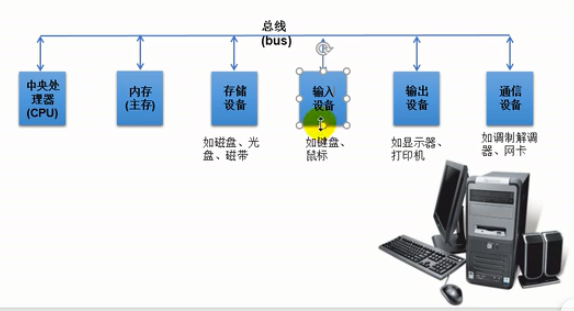
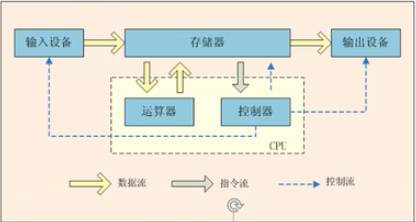
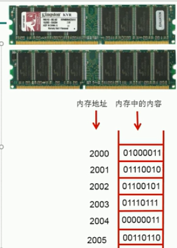
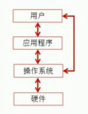
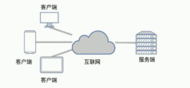
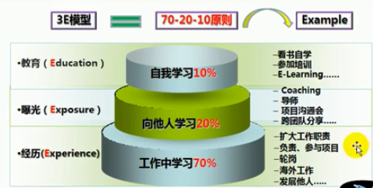

# 概述

计算机包括硬件和软件两个部分。硬件包括计算机中可以看得到的物理部分，而软件提供看不见的指令部分。这些指令控制硬件并且使得硬件完成特定的任务。

## 程序设计

创建或者开发软件，软件包含了指令，告诉计算机做什么。

## 程序设计语言

软件开发人员在程序语言工具帮助下创建软件

## 如何学习那种程序设计语言？

* 没有最好的语言
* 不仅仅就学一门语言
* 各种语言有各自的应用的场景
* 语言之间不会容易串

## 计算机硬件的介绍

计算机可以分为中央处理器、主存、存储设备、输入输出设备、以及通信设备这几个部分。

## 冯诺依曼体系结构

冯诺依曼体系结构是现代计算机的基础。现在大多数的计算机依旧是该组织结构。仅仅是做了一些改进而已，并没有突破该体系结构的束缚。冯诺依曼被称为计算机之父。这里的存储器可以分为两个部分，一部分是内存，另外一部分是硬盘。CPU分为两个部分，一部分四运算器，另外一部分称为控制器。

### 中央处理器

CPU是计算机的大脑，它从内存中获取指令，并执行这些指令。包括

- 控制单元：用于控制和协调其他组件的动作
- 算数/逻辑单元：用于完成数值运算(+、-、*、/)和逻辑运算

### 时钟

每一台计算机中的内部都有一个内部时钟，该时钟是以固定的速度发射电子脉冲，时钟的速度越快，在给定的时间段内执行的指令就越多，速度的计量单位是赫兹，1HZ相当于每秒一个脉冲，随着CPU速度的不断体改，目前以千兆赫（GHZ）来表述。

### 多核
最初一个CPU只有一个核，核是处理器中实现指令读取和执行的部分，一个多核CPU是一个具有两个或者多个独立核的组件，可以提高CPU的处理能力。

## IT行业三大定律

### 摩尔定律

当价格不变的时，集成电路上的可容纳电器件的数目，每隔18-24个月性能就会提升一倍。

### 安迪比尔定律

更高的操作系统需要更好的硬件。

### 反摩尔定律

一个公司如果今天和18个月前卖掉同样多的，同样的产品，那么其营业额就会少一半。

## 存储设备

### 硬盘

- 硬盘的读写速度较慢
- 磁盘可以永远的保存数据和程序

### 内存

- 内存的读写速度较快
- 内存中的信息在断电的时候会丢失

**内存相关概念**

- 比特(bit)和字节(byte)
    - 在讨论内存前，先要清楚数据是如何村塾在计算机中的
    - 计算机就是一系列的电路开关。每个开关存放两种状态，关和开，如果电路是开的。它的值是1，如果电路是关的，它的值是0
    - 一个0或者一个1存储的是一个比特，它是计算机的最小的存储单位
    - 计算机的最基本的存储单元是字节(byte),每个字节是由8个比特组成的
    - 计算机的存储能力是以字节和多字节来衡量的，如下
        * 千字节(KB)=1024B
        * 兆字节(MB)=1024KB

- 内存：也成为RAM，是一个有序的字节序列组成，，用于存储程序以及程序需要的数据
    - 一个程序和它的数据在CPU执行前必须移到计算机的内存中
    - 每个字节都有一个唯一的地址，使用这个地址来确定字节的位置，以便于存储和获取数据
    - 一个计算机具有的RAM越多，它的运行速度越快，但是规律具有限制的
    - 内存和CPU一样，也构建在表名嵌有的数百万的硅半导体芯片上，但是内存更简单、更低速、更便宜
    - 内存存取数据的速度比硬盘快十倍，想要提高计算机的速度，可以增加内存

       

## 输入和输出设备

- 常见的输入设备：键盘和鼠标
- 常见输出设备： 显示器和打印机
- 显示器的平面分辨率：是指显示设备水平和垂直方向上的显示的像素数
    - 可以手工进行设置
    - 分辨率越高，图像越锐化，越清晰

## 网络通信设备

常见的设备有拨号调制解调器、DSL、电缆调制解调器、网络接口卡、无线网络等

## 计算机发展史上的鼻祖

### 图灵

- 计算机科学与人工智能之父
- 图灵机

### 冯诺依曼

- 计算机之父和博弈学之父
- 冯诺依曼理论的要点是数字计算机是采用二进制进行存储，计算机应该按照程序顺序执行

## 操作系统

1. 操作系统是运行在计算机上最重要的程序，它可以管理和控制计算机的活动
2. 硬件、操作系统、应用程序和用户之间的关系
3. 操作系统的主要任务
- 控制和驾驶系统的活动
- 分配和调配系统资源
- 调度操作

## 万维网

* WWW是万维网的英文缩写
- 可以让WEB客户端浏览器访问WEB服务器上的页面
- 在这个系统中每个有用的事物，全部都是可以由统一资源标识符(URL)标识
- 这些资源通过超文本传输协议传送给用户，而后者通过点击连接来获取资源

万维网是由无数个网络站点和网页的集合，他们在一起构成了因特网的最主要组成部分。它实际上是多媒体的集合，是由超级连接而成的，我们通常通过浏览器上网观看，就是万维网的内容。

### B/S架构

通过浏览器访问远程服务器

### C/S架构

比如QQ这样的客户端访问服务器

## 学习模型

不要将自我学习看的过于重要，因为一旦学了这些东西，长期不用的话，就会忘掉。

## 学习经验

1. 锻炼双核处理，边听边思考，边做笔记
2. 纸上得来终觉浅，绝知此事要躬行
- 第一层次：看得懂
- 第二层：练的透（每天的代码必须实现2-3遍）
- 总结：三分看，七分练习

