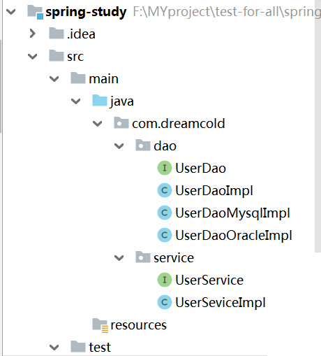
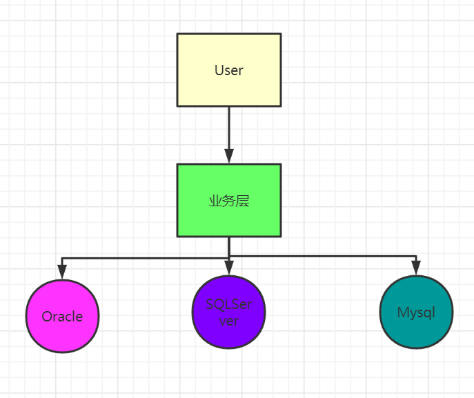
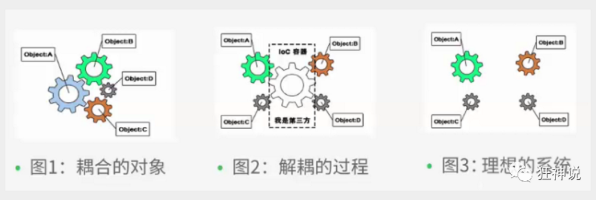
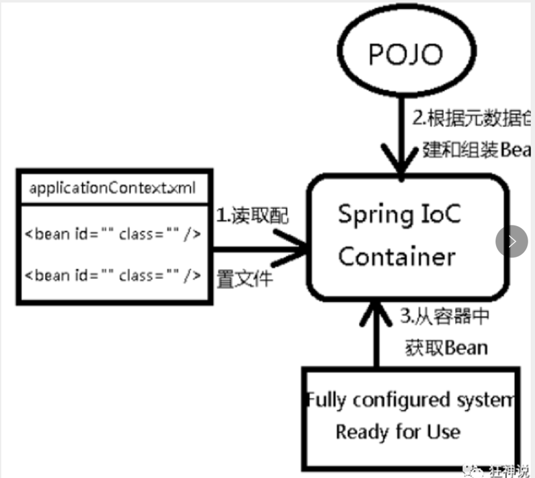

# IOC理论的推导

假设我们要写一个user相关的业务
1. UserDao接口

```java
package com.dreamcold.dao;

public interface UserDao {

    public void getUser();
}

```

2. UserDaoImpl实现类

```java
package com.dreamcold.dao;

public class UserDaoImpl implements UserDao {


    public void getUser() {
        System.out.println("默认获取用户的数据");
    }
}

```

3. UserService 业务接口

```java
package com.dreamcold.service;

public interface UserService {
    public void getUser();
}

```
4. UserServiceImpl 业务实现类

```java
package com.dreamcold.service;

import com.dreamcold.dao.UserDao;
import com.dreamcold.dao.UserDaoImpl;

public class UserSeviceImpl implements UserService {

    private UserDao userDao=new UserDaoImpl();

    public void getUser(){
        userDao.getUser();

    }
}

```

5. 测试一下

```java
import com.dreamcold.service.UserService;
import com.dreamcold.service.UserSeviceImpl;

public class MyTest {
    public static void main(String[] args) {
        UserService userService=new UserSeviceImpl();
        userService.getUser();
    }
}
```

6. 对于Dao层中，假如我们要增加Mysql的实现

```java
package com.dreamcold.dao;

public class UserDaoMysqlImpl implements UserDao {

    public void getUser() {
        System.out.println("Mysql实现获取用户数据");
    }
}

```

7. 假如我们要使用Mysql来实现dao层用户数据的获取

```java
package com.dreamcold.service;

import com.dreamcold.dao.UserDao;
import com.dreamcold.dao.UserDaoImpl;
import com.dreamcold.dao.UserDaoMysqlImpl;

public class UserSeviceImpl implements UserService {

    private UserDao userDao=new UserDaoMysqlImpl();//这里改成mysql的对应实现

    public void getUser(){
        userDao.getUser();

    }
}

```

8. 但是我们发现，我们改了原来的代码假如用户增加了Oracle的实现，每次用户需求修改，我们都需要大量的修改程序，这不是一个优秀的程序应该做的

```java
package com.dreamcold.dao;

public class UserDaoOracleImpl implements UserDao {


    public void getUser() {
        System.out.println("Oracle实现获取用户数据");
    }
}

```

9. 我们这种情况下，还需要修改这里,你的程序无法适应用户的变更，用户一旦需求变化，你就要改很多的东西，这样其实是不成的

```java
package com.dreamcold.service;

import com.dreamcold.dao.UserDao;
import com.dreamcold.dao.UserDaoImpl;
import com.dreamcold.dao.UserDaoMysqlImpl;
import com.dreamcold.dao.UserDaoOracleImpl;

public class UserSeviceImpl implements UserService {

    private UserDao userDao=new UserDaoOracleImpl();//这里改成oracle的对应实现

    public void getUser(){
        userDao.getUser();

    }
}

```

10. 当我们将这里改成对应的setter方法


```java
package com.dreamcold.service;

import com.dreamcold.dao.UserDao;
import com.dreamcold.dao.UserDaoImpl;
import com.dreamcold.dao.UserDaoMysqlImpl;
import com.dreamcold.dao.UserDaoOracleImpl;

public class UserSeviceImpl implements UserService {

    private UserDao userDao;

    //这里的setter方法，利用set来实现动态值的注入
    public void setUserDao(UserDao userDao) {
        this.userDao = userDao;
    }

    public void getUser(){
        userDao.getUser();

    }
}

```

11. 接下来，我们想用什么实现，让用户自己选择实现就可以了

```java
import com.dreamcold.dao.UserDaoOracleImpl;
import com.dreamcold.service.UserService;
import com.dreamcold.service.UserSeviceImpl;

public class MyTest {
    public static void main(String[] args) {
        UserSeviceImpl userService=new UserSeviceImpl();
        userService.setUserDao(new UserDaoOracleImpl()); //想用oracle的实现
        
        userService.getUser();
    }
}

```

- 在我们原来的业务中，用户的需求可能会影响我们原来的diam，我们需要根据用户的需求去修改原代码，如果程序的量非常大，修改代码的代价十分的昂贵，我们仅仅使用set接口实现，已经发生了革命性的变化，原来是程序主动创建对象，控制权在程序员手上，但是使用了set注入后，程序不再具有主动性，而是变成了被动的接受对象！
- 这种思想程序员不用再去管理对象的创建了，而是变成了被动的接受对象。

- 系统的耦合性大大降低，可以专注于扩展于业务

**项目结构**




## IOC的本质



之前
1. 用户访问的是业务层
2. 每增加一个实现，主动权在业务层，无论怎么增加实现，
3. 控制权在程序员的手里

之后

1. 主动权在用户那里，用户选择在哪里调用


控制反转IoC(Inversion of Control)，是一种设计思想，DI(依赖注入)是实现IoC的一种方法，也有人认为DI只是IoC的另一种说法。没有IoC的程序中 , 我们使用面向对象编程 , 对象的创建与对象间的依赖关系完全硬编码在程序中，对象的创建由程序自己控制，控制反转后将对象的创建转移给第三方，个人认为所谓控制反转就是：获得依赖对象的方式反转了。




IoC是Spring框架的核心内容，使用多种方式完美的实现了IoC，可以使用XML配置，也可以使用注解，新版本的Spring也可以零配置实现IoC。

Spring容器在初始化时先读取配置文件，根据配置文件或元数据创建与组织对象存入容器中，程序使用时再从Ioc容器中取出需要的对象。





采用XML方式配置Bean的时候，Bean的定义信息是和实现分离的，而采用注解的方式可以把两者合为一体，Bean的定义信息直接以注解的形式定义在实现类中，从而达到了零配置的目的。

控制反转是一种通过描述（XML或注解）并通过第三方去生产或获取特定对象的方式。在Spring中实现控制反转的是IoC容器，其实现方法是依赖注入（Dependency Injection,DI）。

