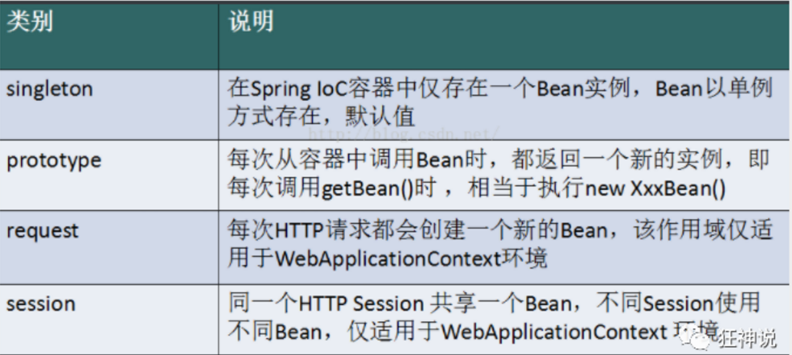

# 依赖注入

## 概念

- 依赖注入
- 依赖：指的是Bean对象的创建依赖于容器，Bean对象的依赖资源
- 注入：指的是Bean对象所依赖的资源，由配置容器来设置和装配

## Set注入

要求被注入的属性，必须要有set方法，set方法的方法名是由set+属性首字母大写，如果属性是boolean类型，1没有set属性，是is

测试pojo类 :

Address.java

```java
package com.dreamcold.demo.pojo;

public class Address {

    private  String address;

    public String getAddress() {
        return address;
    }

    public void setAddress(String address) {
        this.address = address;
    }
}

```
Student.java

```java
package com.dreamcold.demo.pojo;

import java.util.*;

public class Student {

    private String name;
    private Address address;
    private  String[] books;
    private List<String> hobbys;
    private Map<String,String> card;
    private Set<String> games;

    private  String wife;

    private Properties info;


    public String getName() {
        return name;
    }

    public void setName(String name) {
        this.name = name;
    }

    public Address getAddress() {
        return address;
    }

    public void setAddress(Address address) {
        this.address = address;
    }

    public String[] getBooks() {
        return books;
    }

    public void setBooks(String[] books) {
        this.books = books;
    }

    public List<String> getHobbys() {
        return hobbys;
    }

    public void setHobbys(List<String> hobbys) {
        this.hobbys = hobbys;
    }

    public Map<String, String> getCard() {
        return card;
    }

    public void setCard(Map<String, String> card) {
        this.card = card;
    }

    public Set<String> getGames() {
        return games;
    }

    public void setGames(Set<String> games) {
        this.games = games;
    }

    public String getWife() {
        return wife;
    }

    public void setWife(String wife) {
        this.wife = wife;
    }

    public Properties getInfo() {
        return info;
    }

    public void setInfo(Properties info) {
        this.info = info;
    }


    public  void show(){
        System.out.println("name="+ name
                + ",address="+ address.getAddress()
                + ",books="
        );
        for (String book:books){
            System.out.print("<<"+book+">>\t");
        }
        System.out.println("\n爱好:"+hobbys);

        System.out.println("card:"+card);

        System.out.println("games:"+games);

        System.out.println("wife:"+wife);

        System.out.println("info:"+info);
    }

    @Override
    public String toString() {
        return "Student{" +
                "name='" + name + '\'' +
                ", address=" + address +
                ", books=" + Arrays.toString(books) +
                ", hobbys=" + hobbys +
                ", card=" + card +
                ", games=" + games +
                ", wife='" + wife + '\'' +
                ", info=" + info +
                '}';
    }
}

```

### 常量注入

```java
    <bean id="student" class="com.dreamcold.demo.pojo.Student">
        <property name="name" value="xiaoming"></property>
    </bean>
```

测试

```java
package com.dreamcold.demo;


import com.dreamcold.demo.pojo.Student;
import org.junit.jupiter.api.Test;
import org.springframework.context.ApplicationContext;
import org.springframework.context.support.ClassPathXmlApplicationContext;

public class HelloTest {

    @Test
    public void test(){
        ApplicationContext context=new ClassPathXmlApplicationContext("beans.xml");
        //我们的对象都在Spring中管理
        Student student=(Student)context.getBean("student");
        System.out.println(student);
    }
}

```

### Bean的注入

注意点：这里的值是一个引用，ref


```xml
<?xml version="1.0" encoding="UTF-8"?>

<beans xmlns="http://www.springframework.org/schema/beans"
       xmlns:xsi="http://www.w3.org/2001/XMLSchema-instance"
       xsi:schemaLocation="http://www.springframework.org/schema/beans
    http://www.springframework.org/schema/beans/spring-beans-3.0.xsd">

    <bean id="student" class="com.dreamcold.demo.pojo.Student">
        <property name="name" value="xiaoming"></property>
        <property name="address" ref="addr"></property>
    </bean>

    <bean id="addr" class="com.dreamcold.demo.pojo.Address">
        <property name="address" value="ChongQing"></property>
    </bean>
</beans>
```

### 数组的注入

```xml
<?xml version="1.0" encoding="UTF-8"?>

<beans xmlns="http://www.springframework.org/schema/beans"
       xmlns:xsi="http://www.w3.org/2001/XMLSchema-instance"
       xsi:schemaLocation="http://www.springframework.org/schema/beans
    http://www.springframework.org/schema/beans/spring-beans-3.0.xsd">

    <bean id="student" class="com.dreamcold.demo.pojo.Student">
        <property name="name" value="xiaoming"></property>
        <property name="address" ref="addr"></property>
        <property name="books">
            <array>
                <value>西游记</value>
                <value>红楼梦</value>
                <value>水浒传</value>
            </array>
        </property>
    </bean>

    <bean id="addr" class="com.dreamcold.demo.pojo.Address">
        <property name="address" value="ChongQing"></property>
    </bean>
</beans>
```

### List注入

```xml
<?xml version="1.0" encoding="UTF-8"?>

<beans xmlns="http://www.springframework.org/schema/beans"
       xmlns:xsi="http://www.w3.org/2001/XMLSchema-instance"
       xsi:schemaLocation="http://www.springframework.org/schema/beans
    http://www.springframework.org/schema/beans/spring-beans-3.0.xsd">

    <bean id="student" class="com.dreamcold.demo.pojo.Student">
        <property name="name" value="xiaoming"></property>
        <property name="address" ref="addr"></property>
        <property name="books">
            <array>
                <value>西游记</value>
                <value>红楼梦</value>
                <value>水浒传</value>
            </array>
        </property>
        <property name="hobbys">
            <list>
                <value>
                    听歌
                </value>
                <value>
                    看电影
                </value>
                <value>
                    爬山
                </value>

            </list>

        </property>
    </bean>

    <bean id="addr" class="com.dreamcold.demo.pojo.Address">
        <property name="address" value="ChongQing"></property>
    </bean>
</beans>
```

### Map注入

```xml
<?xml version="1.0" encoding="UTF-8"?>

<beans xmlns="http://www.springframework.org/schema/beans"
       xmlns:xsi="http://www.w3.org/2001/XMLSchema-instance"
       xsi:schemaLocation="http://www.springframework.org/schema/beans
    http://www.springframework.org/schema/beans/spring-beans-3.0.xsd">

    <bean id="student" class="com.dreamcold.demo.pojo.Student">
        <property name="name" value="xiaoming"></property>
        <property name="address" ref="addr"></property>
        <property name="books">
            <array>
                <value>西游记</value>
                <value>红楼梦</value>
                <value>水浒传</value>
            </array>
        </property>
        <property name="hobbys">
            <list>
                <value>
                    听歌
                </value>
                <value>
                    看电影
                </value>
                <value>
                    爬山
                </value>

            </list>

        </property>

        <property name="card">
            <map>
                <entry key="中国邮政" value="1234567"></entry>
                <entry key="建设银行" value="1223334"></entry>
            </map>
        </property>
    </bean>

    <bean id="addr" class="com.dreamcold.demo.pojo.Address">
        <property name="address" value="ChongQing"></property>
    </bean>
</beans>
```

### Set注入

```xml
<?xml version="1.0" encoding="UTF-8"?>

<beans xmlns="http://www.springframework.org/schema/beans"
       xmlns:xsi="http://www.w3.org/2001/XMLSchema-instance"
       xsi:schemaLocation="http://www.springframework.org/schema/beans
    http://www.springframework.org/schema/beans/spring-beans-3.0.xsd">

    <bean id="student" class="com.dreamcold.demo.pojo.Student">
        <property name="name" value="xiaoming"></property>
        <property name="address" ref="addr"></property>
        <property name="books">
            <array>
                <value>西游记</value>
                <value>红楼梦</value>
                <value>水浒传</value>
            </array>
        </property>
        <property name="hobbys">
            <list>
                <value>
                    听歌
                </value>
                <value>
                    看电影
                </value>
                <value>
                    爬山
                </value>

            </list>

        </property>

        <property name="card">
            <map>
                <entry key="中国邮政" value="1234567"></entry>
                <entry key="建设银行" value="1223334"></entry>
            </map>
        </property>

        <property name="games">
            <set>
                <value>LOL</value>
                <value>王者荣耀</value>
                <value>吃鸡</value>
            </set>
        </property>
    </bean>

    <bean id="addr" class="com.dreamcold.demo.pojo.Address">
        <property name="address" value="ChongQing"></property>
    </bean>


</beans>
```

### NULL值注入

```xml

        <property name="wife">
            <null></null>
        </property>
```

### Properties注入

```xml
        <property name="info">
            <props>
                <prop key="姓名">小明</prop>
                <prop key="性别">男</prop>
                <prop key="学号">123355</prop>
            </props>
        </property>
```

测试结果


## p命名和c命名注入

User.java ：【注意：这里没有有参构造器！】

```java
package com.dreamcold.demo.pojo;

public class User {
    private String name;
    private int age;

    public String getName() {
        return name;
    }

    public void setName(String name) {
        this.name = name;
    }

    public int getAge() {
        return age;
    }

    public void setAge(int age) {
        this.age = age;
    }

    @Override
    public String toString() {
        return "User{" +
                "name='" + name + '\'' +
                ", age=" + age +
                '}';
    }
}

```

1、P命名空间注入 : 需要在头文件中加入约束文件

```
导入约束 : xmlns:p="http://www.springframework.org/schema/p"
```

```xml
    <bean id="user" class="com.dreamcold.demo.pojo.User" p:name="yujian" p:age="12">
    </bean>
```

2、c 命名空间注入 : 需要在头文件中加入约束文件
```
导入约束 : xmlns:c="http://www.springframework.org/schema/c"
```
```xml
    <bean id="myuser" class="com.dreamcold.demo.pojo.User" c:name="yujian" c:age="12">

    </bean>
```

发现问题：爆红了，刚才我们没有写有参构造！

解决：把有参构造器加上，这里也能知道，c 就是所谓的构造器注入！

测试代码：

```java
package com.dreamcold.demo;

import com.dreamcold.demo.pojo.User;
import org.junit.jupiter.api.Test;
import org.springframework.context.ApplicationContext;
import org.springframework.context.support.ClassPathXmlApplicationContext;

public class HelloTest {

    @Test
    public void test(){
        ApplicationContext context=new ClassPathXmlApplicationContext("beans.xml");
        //我们的对象都在Spring中管理
        User user=(User)context.getBean("myuser");
        System.out.println(user);
    }
}

```

## Bean的作用域

在Spring中，那些组成应用程序的主体及由Spring IoC容器所管理的对象，被称之为bean。简单地讲，bean就是由IoC容器初始化、装配及管理的对象 .





几种作用域中，request、session作用域仅在基于web的应用中使用（不必关心你所采用的是什么web应用框架），只能用在基于web的Spring ApplicationContext环境。


Singleton

当一个bean的作用域为Singleton，那么Spring IoC容器中只会存在一个共享的bean实例，并且所有对bean的请求，只要id与该bean定义相匹配，则只会返回bean的同一实例。Singleton是单例类型，就是在创建起容器时就同时自动创建了一个bean的对象，不管你是否使用，他都存在了，每次获取到的对象都是同一个对象。注意，Singleton作用域是Spring中的缺省作用域。要在XML中将bean定义成singleton，可以这样配置：
```
 <bean id="ServiceImpl" class="cn.csdn.service.ServiceImpl" scope="singleton">
```
测试：
```
 @Test
 public void test03(){
     ApplicationContext context = new ClassPathXmlApplicationContext("applicationContext.xml");
     User user = (User) context.getBean("user");
     User user2 = (User) context.getBean("user");
     System.out.println(user==user2);
 }
```
Prototype

当一个bean的作用域为Prototype，表示一个bean定义对应多个对象实例。Prototype作用域的bean会导致在每次对该bean请求（将其注入到另一个bean中，或者以程序的方式调用容器的getBean()方法）时都会创建一个新的bean实例。Prototype是原型类型，它在我们创建容器的时候并没有实例化，而是当我们获取bean的时候才会去创建一个对象，而且我们每次获取到的对象都不是同一个对象。根据经验，对有状态的bean应该使用prototype作用域，而对无状态的bean则应该使用singleton作用域。在XML中将bean定义成prototype，可以这样配置：
```
 <bean id="account" class="com.foo.DefaultAccount" scope="prototype"/>  
  或者
 <bean id="account" class="com.foo.DefaultAccount" singleton="false"/>
 ```
Request

当一个bean的作用域为Request，表示在一次HTTP请求中，一个bean定义对应一个实例；即每个HTTP请求都会有各自的bean实例，它们依据某个bean定义创建而成。该作用域仅在基于web的Spring ApplicationContext情形下有效。考虑下面bean定义：
```
 <bean id="loginAction" class=cn.csdn.LoginAction" scope="request"/>
```
针对每次HTTP请求，Spring容器会根据loginAction bean的定义创建一个全新的LoginAction bean实例，且该loginAction bean实例仅在当前HTTP request内有效，因此可以根据需要放心的更改所建实例的内部状态，而其他请求中根据loginAction bean定义创建的实例，将不会看到这些特定于某个请求的状态变化。当处理请求结束，request作用域的bean实例将被销毁。

Session

当一个bean的作用域为Session，表示在一个HTTP Session中，一个bean定义对应一个实例。该作用域仅在基于web的Spring ApplicationContext情形下有效。考虑下面bean定义：
```
 <bean id="userPreferences" class="com.foo.UserPreferences" scope="session"/>
```
针对某个HTTP Session，Spring容器会根据userPreferences bean定义创建一个全新的userPreferences bean实例，且该userPreferences bean仅在当前HTTP Session内有效。与request作用域一样，可以根据需要放心的更改所创建实例的内部状态，而别的HTTP Session中根据userPreferences创建的实例，将不会看到这些特定于某个HTTP Session的状态变化。当HTTP Session最终被废弃的时候，在该HTTP Session作用域内的bean也会被废弃掉。